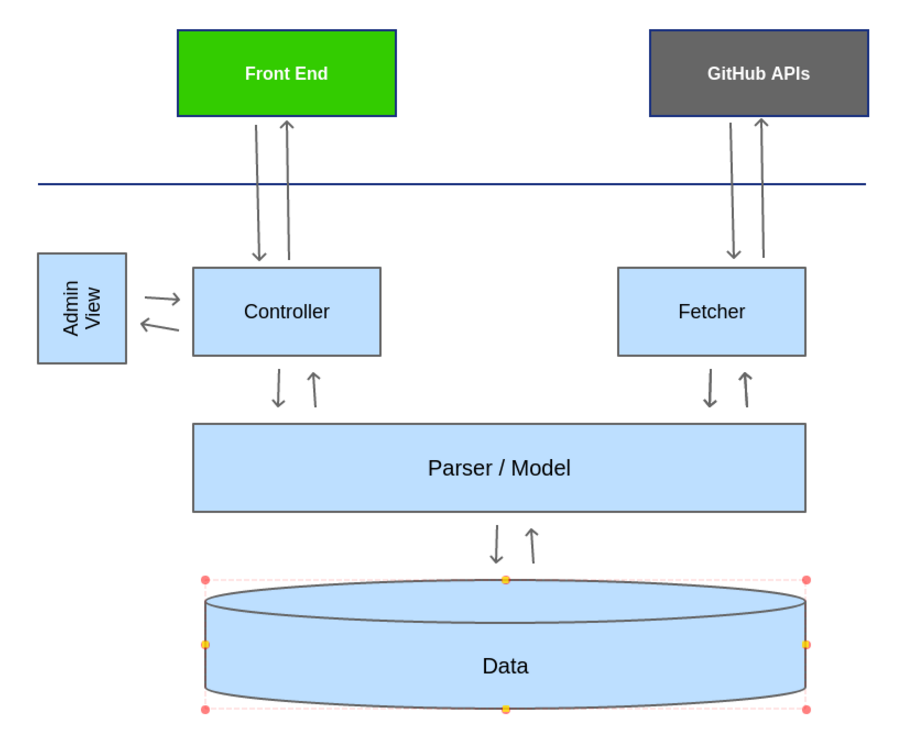

# issue_parser_backend

[](https://travis-ci.org/razat249/issue_parser_backend)
[](https://github.com/razat249/issue_parser_backend/issues)

Backend API of issue parser app. This repository is required to successfully run the app you can find the front end client [here](https://github.com/mozillacampusclubs/issue_parser_frontend/).


## How to deploy
> To successfully run full app, you have to deploy the front end client also. You can find the front end client documentation [here](https://github.com/mozillacampusclubs/issue_parser_frontend/)

So lets start with the basic steps on how to deploy this back-end API.
- Install Python 2.7 and pip on the system.
- Open a terminal
- run `pip install -r requirements.txt`
- **RELEX . . .**
- run `python manage.py makemigration` for making migrations.
- run `python manage.py migrate` for migrating database.
- run `python manage.py createsuperuser` to create a login password for logging in to admin panel.
- For starting dev-server run `python manage.py runserver`.
- **Admin view**: To add repositories head to `/admin/`. Add repositories to the system, which you want to use. The system will fetch the issues of these repositories. you have to fill the username and repo name.
- Now you also have to setup worker server (alongside main server) for fetching github issues periodically (15 mins). For this follow these steps:
    - Open another terminal and run `celery -A issue_parser beat -l info`.
    - Open one more terminal and run `celery -A issue_parser worker -l info`
- Now fire up a browser and go to `/issues/` for seeing the json data of issues.
> You have to add repositories to the system or the app will not fetch issues.

**Issues should follow this template to be valid for the system:**
```
Experience: Easyfix/Moderate/Senior
Expected-time: 1 week/2 months/etc.
Language: python/Javascript/others
Technology-stack: Django/React.js/others

## Description
Write your description here.
```

<!--**For full guide on how to deploy the back end go [here](./docs/deploy.md)**-->


## How to Contribute
You can report bugs at the [issue tracker](https://github.com/mozillacampusclubs/issue_parser_backend/issues).

> Help us by creating Pull Requests and solving [issues](https://github.com/mozillacampusclubs/issue_parser_backend/issues)
> For more in-depth knowledge of system read below `How it works`

**For setting up development environment follow these steps:**
- Install Python 2.7 and pip on your system.
- Open a terminal
- Install virtualenv using cmd `pip install virtualenv`.
- Clone this repo.
- cd into the repo.
- Create virtual env by running `virtualenv env`.
- run `source env/bin/activate`.
- run `pip install -r requirements.txt`
- **RELEX . . .**
- run `python manage.py makemigration` for making migrations.
- run `python manage.py migrate` for migrating database.
- run `python manage.py createsuperuser` to create a login password for loging in to admin panel.
- For starting dev-server run `python manage.py runserver`.
- **Admin view**: To add repositories head to `/admin/`. Add repositories to the system, which you want to use. The system will fetch the issues of these repositories. you have to fill the username and repo name.
- Now you also have to setup worker server (alongside main server) for fetching github issues periodically (15 mins). For this follow these steps:
    - Open another terminal and run `celery -A issue_parser beat -l info`.
    - Open one more terminal and run `celery -A issue_parser worker -l info`
- Now fire up a browser and go to `/issues/` for seeing the json data of issues.
> You have to add repositories to the system or the app will not fetch issues.

**Issues should follow this template to be valid for the system:**
```
Experience: Easyfix/Moderate/Senior
Expected-time: 1 week/2 months/etc.
Language: python/Javascript/others
Technology-stack: Django/React.js/others

## Description
Write your description here.
```

## How it works
This image of the system below will give you a rough overview of how api works.


There will be several components in the backend:
1. **Fetcher** : This component will fetch the data from the github API (issues in our case). This component will do only one thing i.e. fetching the data. I suggest to keep the frequency of data fetching in every 15 mins.
2. **Parser/Model** : This component will do 3 things:
Checking if the issue is passing all the quality and documentation criteria.
Parsing the data according to the schema we have for the issues.
And saving the data to database.
3. **Data** : This is database containing two table Repositories and Issues.
4. **Controller** : This is a thin layer between Model and front end. This layer will handle all the routing and REST APIs stuff.
5. **Admin View** : Admin view can be used to add or remove repos from the system.

<!--## License
To Do - discuss with mentor.-->
